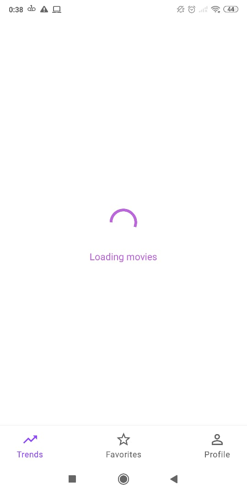
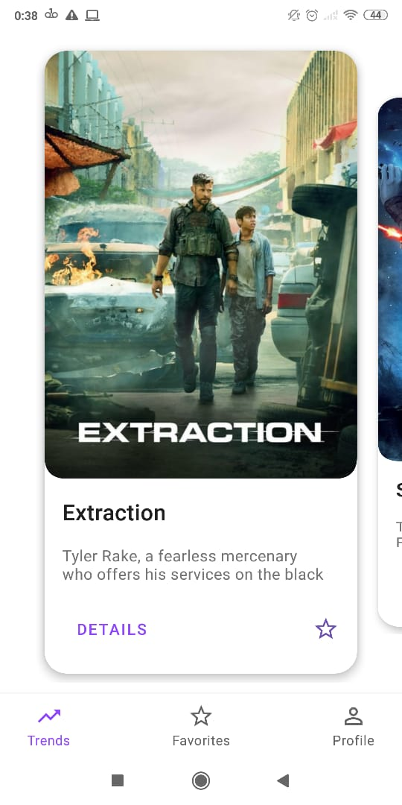
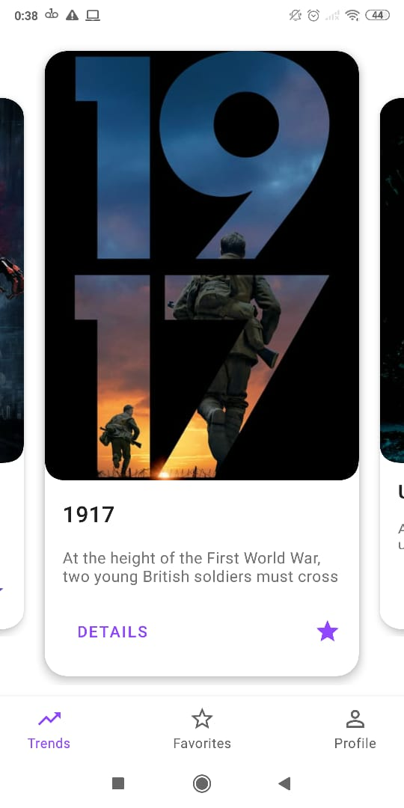
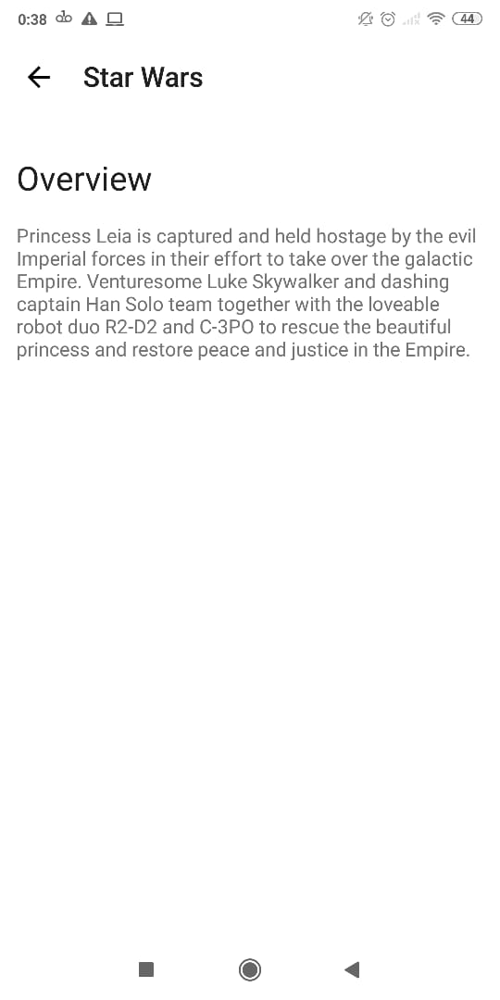
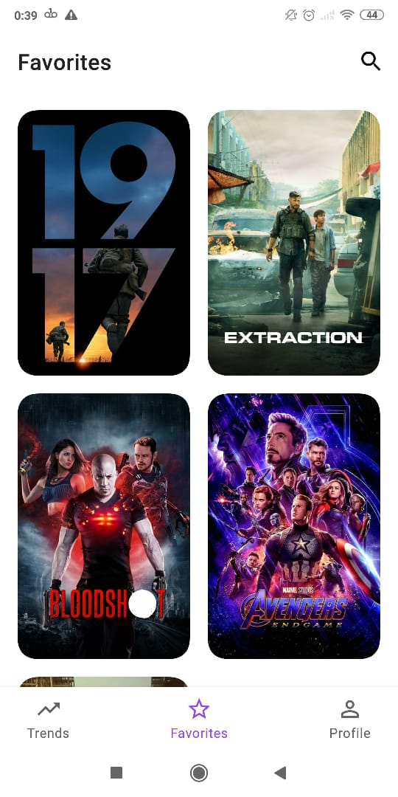
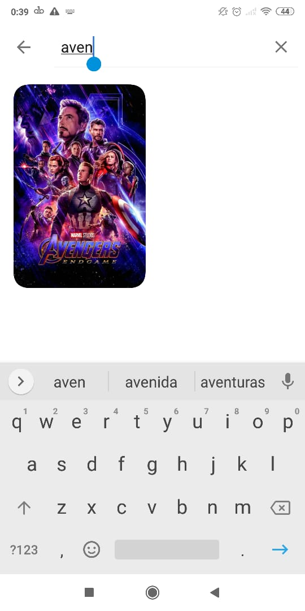
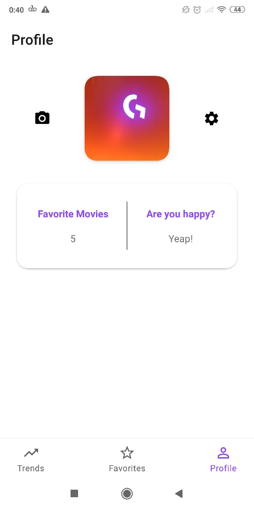

# Pillow 
This repository was created to understand some libraries and common architectural patterns used in software development. The project uses Clean Architecture and was strutured using multi modules. The api used to consume the data can be found on [TMDB site](https://www.themoviedb.org/).

The api key can be changed in the Constants file like:
```
const val API_KEY = YOUR_API_KEY  
const val BASE_URL = "https://api.themoviedb.org/3/"  
const val BASE_BACKDROP_IMAGE_URL = "http://image.tmdb.org/t/p/w500/"
```
---
**Libraries & Tools:**
- Navigation
- Room
- Data Binding
- Live Data 
- Paging
- ViewModel
- Permissions
- ViewPager2
- Retrofit
- Glide
- CameraX

---

**Screenshots:**
<div>
  &nbsp
  
  &nbsp
  &nbsp
  
  &nbsp
  &nbsp
  
  &nbsp
  &nbsp
  
  
</div>
